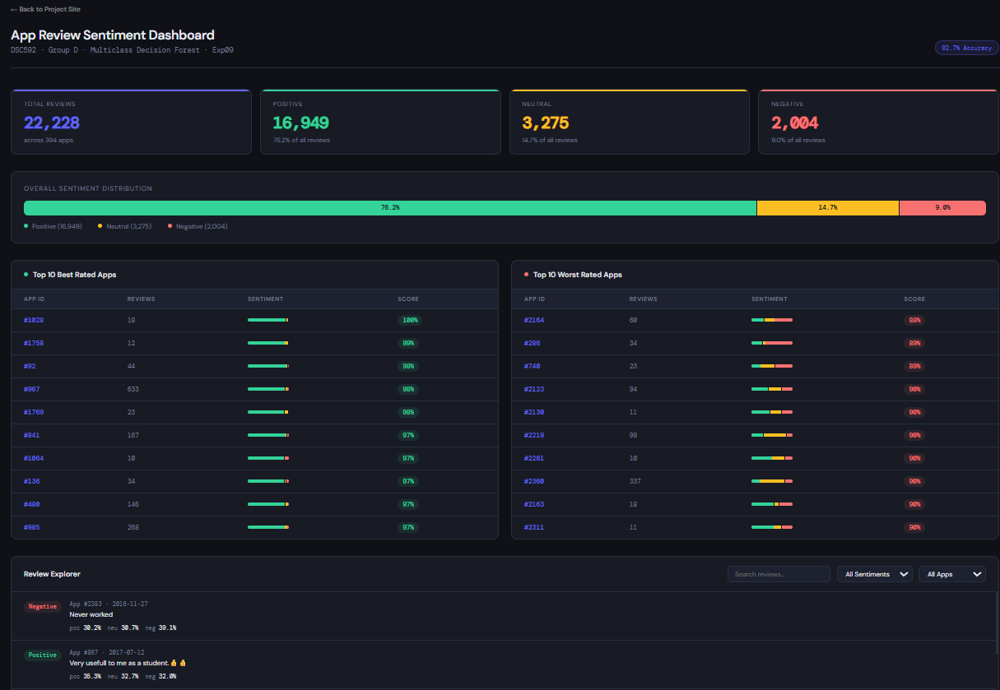
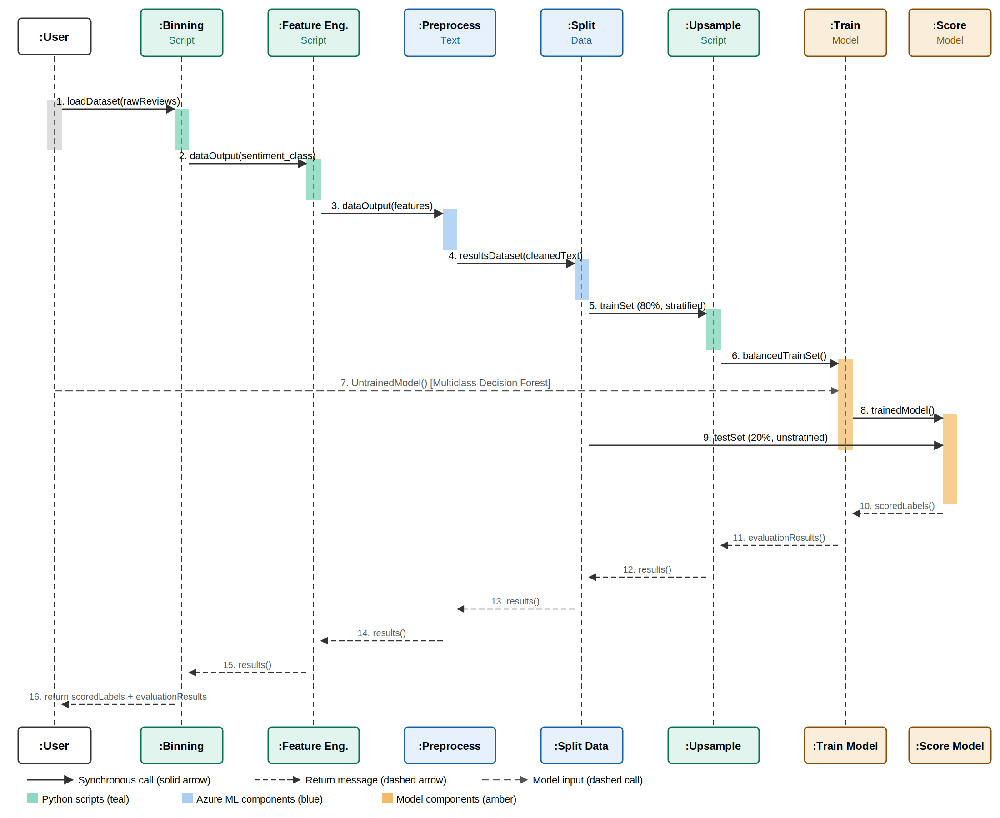

# 📱 App Review Sentiment Pipeline

> A machine learning pipeline that classifies mobile app store reviews into positive, neutral, and negative sentiment using a Multiclass Decision Forest, achieving **92.7% accuracy**. Built with Azure ML Studio and includes a stakeholder dashboard with filtering and confidence score display.

**DSC592 · Group D · University of North Carolina Wilmington · Spring 2026**

---

## 👥 Team

| Name | Role |
|------|------|
| Jacob Woodard | Webpage, GitHub Management, ML Pipeline |
| Michelle Messer | ML Model Management, GitHub Management, Dashboard |
| Scarlett Shropshire | Research, Documentation, Architecture Diagrams |

---

## 🏆 Final Model Performance

| Metric | Value |
|--------|-------|
| Overall Accuracy | **92.7%** |
| Macro Precision | 0.886 |
| Macro Recall | 0.901 |
| Total Reviews | 22,228 |
| Apps Covered | 492 |
| Model | Multiclass Decision Forest |

---

## 📊 Dashboard



The dashboard gives stakeholders a live view of model results including top 10 best and worst rated apps, overall sentiment distribution, and a filterable review explorer with confidence scores per prediction.

---

## 🔄 Pipeline Architecture



### Pipeline Stages

```
Data Ingestion
    └── Sentiment Binning (negative / neutral / positive)
        └── Feature Engineering (exclamation count, question count, text length)
            └── Preprocess Text (normalization)
                └── Stratified Split (80% train / 20% test)
                    ├── Upsampling (train only) → Train Model (Multiclass Decision Forest)
                    └── Score Model → Evaluate Model
```

---

## 🧪 Experiment Log

| Experiment | Change | Metric | Result |
|------------|--------|--------|--------|
| Exp01 | Baseline Linear Regression | R² | 0.059 |
| Exp02 | Stratified Split | R² | 0.059 |
| Exp04 | Boosted Decision Tree | R² | 0.106 |
| Exp05 | Sentiment Feature Engineering | R² | 0.151 |
| Exp06 | Multiclass Classification | Accuracy | 77.7% |
| Exp07 | Hyperparameter Tuning | Accuracy | 77.7% |
| Exp08 | Upsampling (balanced classes) | Accuracy | 92.7% ✅ |

Full experiment logs with screenshots are in the [`/experiments`](./experiments/) folder.

---

## 🛠️ Tech Stack


---

## 📁 Repository Structure

```
├── docs/               # Reports, diagrams, and documentation
├── experiments/        # Markdown logs and screenshots for each experiment
├── notebooks/          # Data exploration notebooks
├── src/                # Source scripts
├── web/                # Project webpage files
└── azure/              # Azure ML pipeline notes
```

---

## 🌐 Project Webpage

The live project webpage is available via GitHub Pages and includes architecture diagrams, pipeline visualization, metrics, and an interactive phase tracker.

---

## 📄 Reports

All phase reports are available in the [`/docs`](./docs/) folder:
- Phase 1 — Inception
- Phase 2 — Elaboration and Planning
- Phase 3 — Construction
- Phase 4 — Transition
- Cumulative Final Report
